# AI Agentic Health Tracker

<div align="center">
  <svg width="200" height="200" viewBox="0 0 200 200">
    <!-- Circular gradient background -->
    <defs>
      <linearGradient id="logoGradient" x1="0%" y1="0%" x2="100%" y2="100%">
        <stop offset="0%" style="stop-color:#e74c3c;stop-opacity:1" />
        <stop offset="100%" style="stop-color:#9b59b6;stop-opacity:1" />
      </linearGradient>
    </defs>

    <!-- Circle background -->
    <circle cx="100" cy="100" r="95" fill="url(#logoGradient)" opacity="0.1" stroke="url(#logoGradient)" stroke-width="2"/>

    <!-- Heart icon -->
    <path d="M100,140 C60,120 40,100 40,80 C40,65 50,55 60,55 C70,55 80,65 100,80 C120,65 130,55 140,55 C150,55 160,65 160,80 C160,100 140,120 100,140 Z"
          fill="url(#logoGradient)" stroke="none"/>

    <!-- AI lines -->
    <line x1="50" y1="160" x2="80" y2="180" stroke="url(#logoGradient)" stroke-width="2" opacity="0.6"/>
    <line x1="120" y1="160" x2="150" y2="180" stroke="url(#logoGradient)" stroke-width="2" opacity="0.6"/>
    <circle cx="65" cy="170" r="3" fill="url(#logoGradient)"/>
    <circle cx="135" cy="170" r="3" fill="url(#logoGradient)"/>
  </svg>

  <h2>Comprehensive AI-Powered Health Monitoring & Analysis Platform</h2>

  <p>
    <a href="https://projectz-health-ai-agentic-c93722.netlify.app/" style="display: inline-block; padding: 12px 24px; background: linear-gradient(135deg, #e74c3c, #9b59b6); color: white; text-decoration: none; border-radius: 8px; font-weight: bold; margin-top: 20px;">
      ► Launch App
    </a>
  </p>

  <p><strong>Created by Aditya K</strong> | Capstone Project</p>
</div>

---

## Table of Contents
- [Problem Statement](#problem-statement)
- [Solution Overview](#solution-overview)
- [Key Features](#key-features)
- [Application Architecture](#application-architecture)
- [Pages & Features In Detail](#pages--features-in-detail)
- [Technology Stack](#technology-stack)
- [How to Use](#how-to-use)
- [Privacy & Security](#privacy--security)

---

## Problem Statement

Modern healthcare faces critical challenges:

- **Limited Accessibility**: Many people lack immediate access to healthcare professionals
- **Delayed Diagnosis**: Wait times for medical consultations are long
- **Health Awareness Gap**: People don't track their vital signs regularly
- **Data Fragmentation**: Medical records are scattered across different providers
- **Personalization**: Generic health advice doesn't account for individual circumstances
- **Disease Monitoring**: No unified view of disease trends in communities and regions

**AI Agentic Health Tracker** solves these problems by providing:
- ✓ Instant AI-powered health analysis 24/7
- ✓ Personalized insights based on WHO standards
- ✓ Comprehensive vital sign tracking
- ✓ Medical image analysis
- ✓ Community health insights
- ✓ All data stored locally on your device

---

## Solution Overview

AI Agentic Health Tracker is a privacy-first health monitoring platform that leverages AI to provide instant, personalized health insights. Users can track vital signs, analyze medical images, get AI-powered recommendations, and stay informed about disease trends in their communities.

```mermaid
graph TB
    A["User Registration"] --> B["Profile Setup"]
    B --> C["Health Tracking Dashboard"]

    C --> D["Health Check-up"]
    C --> E["Image Analysis"]
    C --> F["AI Companion"]
    C --> G["Community Health"]
    C --> H["Progress Tracking"]

    D --> I["Health Report"]
    E --> I
    F --> I

    I --> J["Personalized Recommendations"]
    G --> K["Disease Tracking"]
    H --> L["Analytics & Insights"]

    style A fill:#e74c3c
    style B fill:#e74c3c
    style C fill:#9b59b6
    style D fill:#3498db
    style E fill:#2ecc71
    style F fill:#f39c12
    style G fill:#1abc9c
    style H fill:#34495e
    style I fill:#9b59b6
    style J fill:#e74c3c
    style K fill:#3498db
    style L fill:#2ecc71
```

---

## Key Features

### 1. **Health Check-up**
Comprehensive vital sign monitoring with real-time analysis
- Blood pressure (Systolic & Diastolic)
- Heart rate monitoring
- Blood glucose tracking
- Cholesterol levels
- Body temperature
- Emergency alerts for critical readings

### 2. **Medical Image Analysis**
AI-powered analysis of medical imaging
- X-ray interpretation
- MRI analysis
- Skin lesion detection
- Advanced confidence scoring
- Clinical recommendations

### 3. **AI Companion**
Conversational AI for health guidance
- Chat-based health queries
- Personalized recommendations
- 24/7 availability
- Context-aware responses

### 4. **Community Health**
Real-time disease tracking and epidemiology
- Global disease statistics
- Regional outbreak information
- Prevention strategies
- Community health trends

### 5. **Disease Tracker**
Comprehensive disease database and tracking
- Communicable & non-communicable diseases
- Symptoms and prevention methods
- Treatment information
- Global & regional statistics

### 6. **Progress Tracking**
Long-term health monitoring and analytics
- Historical vital sign trends
- Predictive analytics
- Health improvement tracking
- Data visualization

### 7. **Bluetooth Integration**
Seamless device connectivity
- Wearable device support
- Real-time data sync
- Automatic vital capture

---

## Application Architecture

### System Flow Diagram

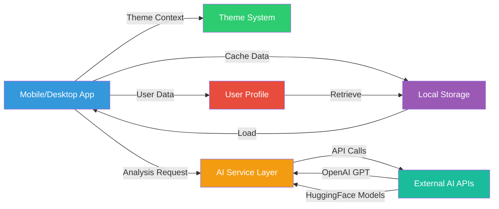

### Component Architecture

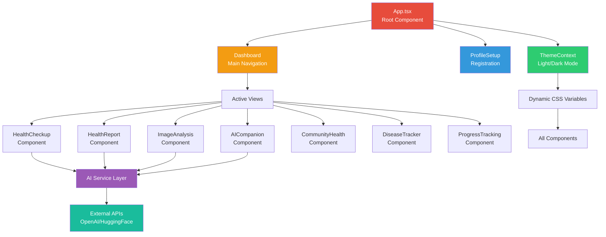

---

## Pages & Features In Detail

### Page 1: Registration & Profile Setup

**Purpose**: Collect user information for personalized health insights

**Key Data Collected**:
- Personal Information: Name, age, gender, location
- Physical Measurements: Height, weight, waist, hip circumference
- Health History: Allergies, genetic markers
- AI Provider Setup: API key configuration

**Features**:
- Step-by-step form wizard
- Input validation
- Local storage persistence
- Light/Dark mode toggle on setup page

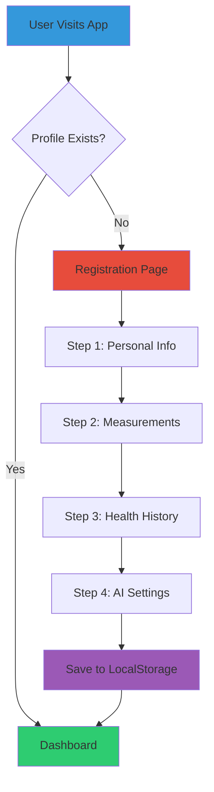

**UI Components**:
- Form inputs with validation
- Dropdown selectors for location
- Number inputs with range validation
- Light/Dark theme switcher

**Mockup**: 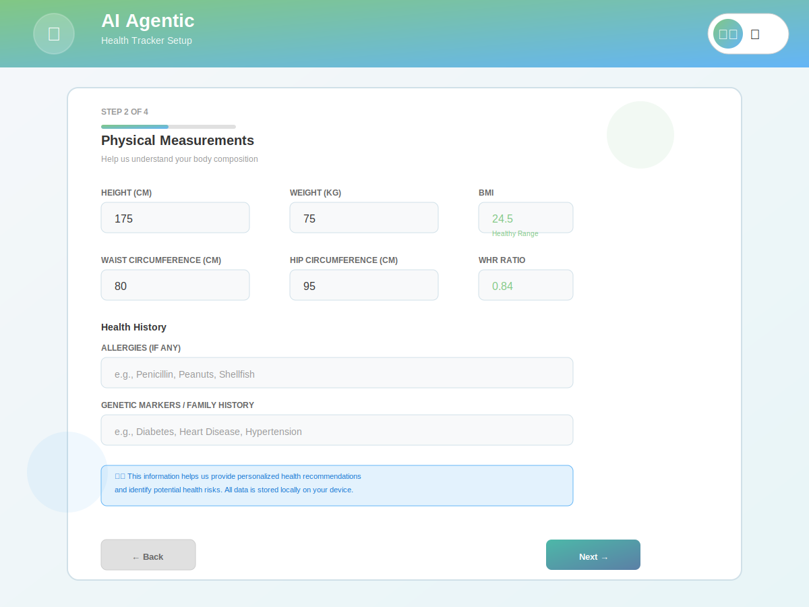

### Page 2: Health Check-up Dashboard

**Purpose**: Daily vital sign tracking and health monitoring

**Key Inputs**:
- Systolic & Diastolic Blood Pressure (mmHg)
- Heart Rate (bpm)
- Blood Glucose (mg/dL)
- Cholesterol (mg/dL)
- Body Temperature (°F)
- Time of Day (morning/afternoon/evening)

**Features**:
- Real-time input validation with safe ranges
- Emergency alert system for critical values
- Health status indicator badges
- Time-of-day categorization
- Quick access from dashboard

**Data Flow**:
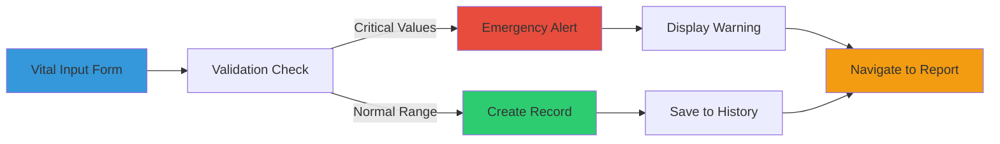

**Mockup**: 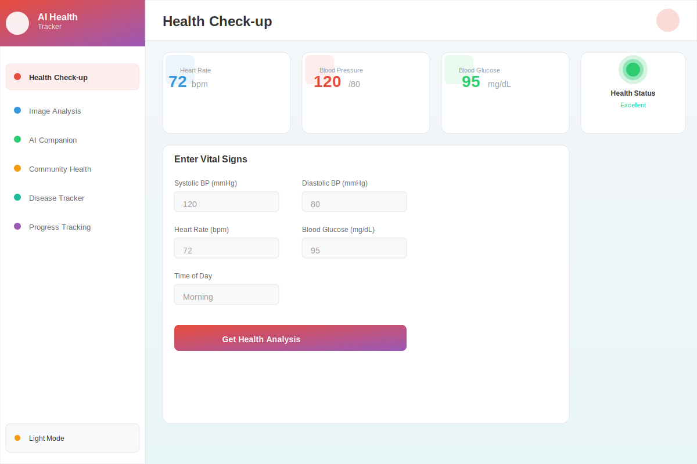

### Page 3: Health Report (AI-Generated)

**Purpose**: Comprehensive AI-powered health analysis

**Analysis Includes**:
- Vital sign interpretation
- Risk assessment
- Personalized recommendations
- Dietary suggestions
- Exercise recommendations
- Medication alerts
- Trend analysis

**Key Metrics Analyzed**:
- Blood pressure classification (Normal/Elevated/Stage 1-2 Hypertension)
- Heart rate variability
- Glucose control assessment
- Cholesterol risk factors
- Temperature abnormalities
- BMI and body composition

**AI-Powered Features**:
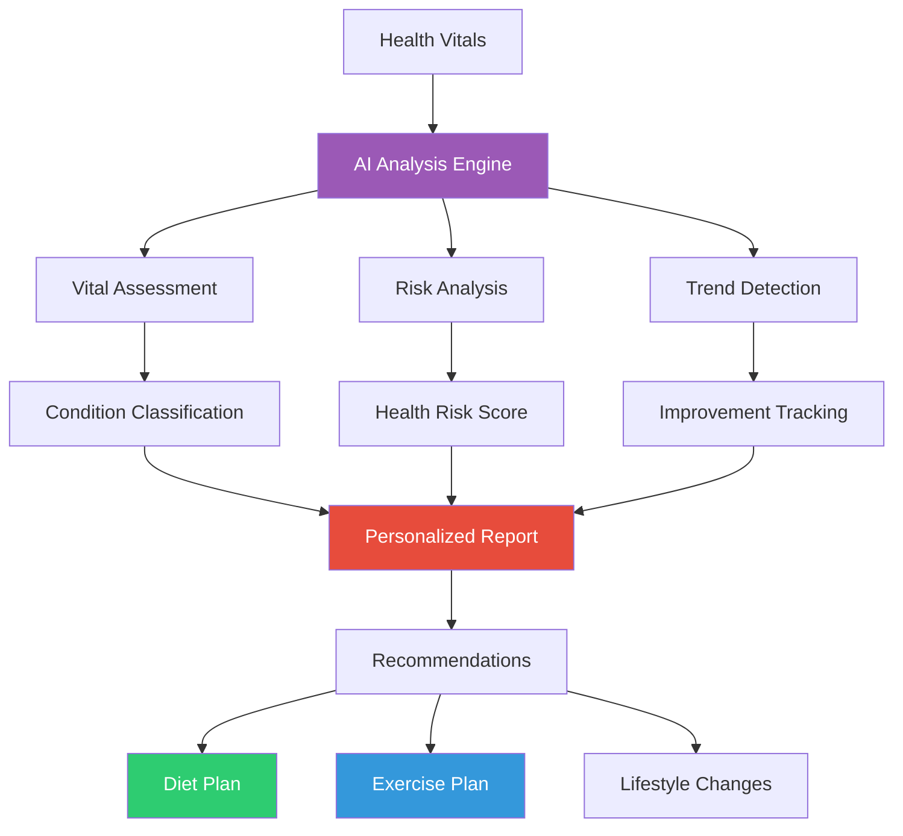

**Report Sections**:
1. Executive Summary - Overall health status
2. Vital Signs Analysis - Detailed interpretation
3. Risk Assessment - Potential health concerns
4. Recommendations - Actionable health advice
5. Historical Trends - Progress over time

**Mockup**: 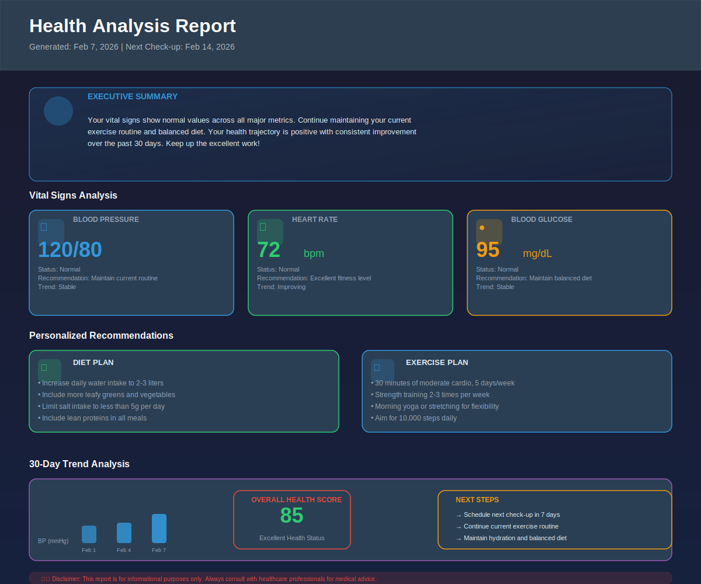

### Page 4: Medical Image Analysis

**Purpose**: AI-powered analysis of medical imaging

**Supported Image Types**:
- X-rays (chest, limbs, spine)
- MRI scans
- Skin lesions & dermatology
- General medical images

**Analysis Features**:
- Automated pathology detection
- Confidence scoring (0-100%)
- Clinical findings
- Recommendations
- Add to health record option

**Workflow**:
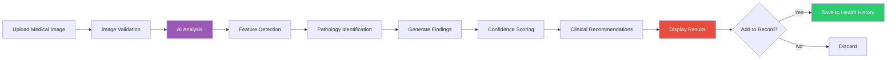

### Page 5: AI Companion

**Purpose**: 24/7 conversational health guidance

**Capabilities**:
- Health Q&A
- Symptom discussion
- Medication information
- Lifestyle counseling
- Mental health support
- Emergency guidance

**Features**:
- Context-aware responses
- Multi-turn conversations
- Medical terminology translation
- Source citations
- Conversation history

**Interaction Flow**:
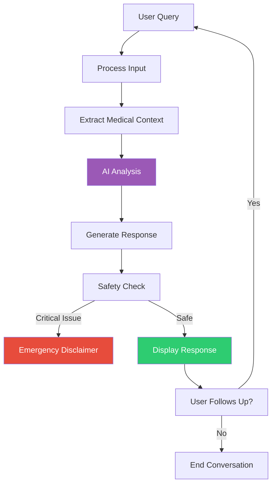

### Page 6: Community Health & Disease Tracking

**Purpose**: Real-time epidemiological data and community health insights

**Data Tracked**:
- Global disease statistics
- Regional outbreak information
- Disease prevalence by location
- Transmission rates
- Prevention measures
- Treatment options

**Features**:
- Interactive disease maps
- Global vs regional statistics
- Prevention strategies
- Latest news integration
- Risk assessment for user location
- Communicable vs non-communicable diseases

**Disease Data Structure**:
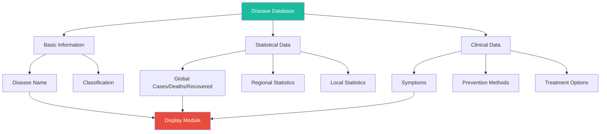

**Mockup**: 

### Page 7: Progress Tracking & Analytics

**Purpose**: Long-term health monitoring with predictive analytics

**Tracked Metrics**:
- Vital sign trends over time
- Health improvement indicators
- Goal progress
- Historical records
- Comparative analysis

**Analytics Features**:
- Line charts for vital trends
- Statistical analysis
- Predictive forecasting
- Goal setting & tracking
- Performance badges
- Monthly/quarterly reports

**Analytics Dashboard**:
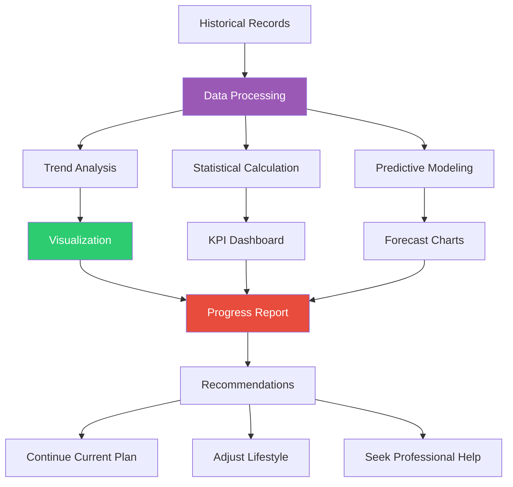

**Mockup**: 

---

## Technology Stack

### Frontend
- **React 18.3** - UI framework
- **TypeScript** - Type safety
- **Tailwind CSS** - Styling
- **Lucide React** - Icons
- **Recharts** - Data visualization

### AI & APIs
- **OpenAI GPT API** - Health analysis & recommendations
- **HuggingFace Models** - Image analysis & ML tasks
- **Custom AI Service Layer** - Unified API handling

### Storage & State
- **LocalStorage** - Client-side data persistence
- **React Context** - Theme & app state management
- **Supabase** - Optional backend integration

### Development
- **Vite** - Build tool & dev server
- **ESLint** - Code quality
- **TypeScript** - Type checking
- **Tailwind CSS** - Responsive design

---

## Theme System Architecture

The application features a sophisticated light and dark mode system with oil-paint inspired color schemes:

### Light Theme
- **Background**: Soft white with subtle green tint
- **Cards & Surfaces**: Light cream to pale green
- **Buttons & Borders**: Fresh green and blue oil-mix colors
- **Text**: Dark gray for maximum readability
- **Accents**: Green and blue gradients

### Dark Theme
- **Background**: Deep charcoal with blue tint
- **Cards & Surfaces**: Dark gray with slight purple tint
- **Buttons & Borders**: Red and violet oil-paint colors
- **Text**: Light gray/white for contrast
- **Accents**: Red and purple gradients

**Theme Variables** (CSS Custom Properties):
```css
--bg-primary: Primary background
--bg-secondary: Card & surface backgrounds
--bg-tertiary: Borders & subtle elements
--text-primary: Main text color
--text-secondary: Secondary/muted text
--accent-gradient: Theme-matched gradient
```

---

## How to Use

### 1. Setup Profile
1. Visit the app
2. Click "Create Profile"
3. Fill in your personal information
4. Add health measurements
5. Configure AI provider (OpenAI or HuggingFace)
6. Save profile

### 2. Daily Health Tracking
1. Navigate to "Health Check-up"
2. Enter your vital signs
3. Select time of day
4. Submit for analysis
5. Review AI-generated health report

### 3. Medical Image Analysis
1. Go to "Image Analysis"
2. Upload a medical image (X-ray, MRI, skin lesion, etc.)
3. Wait for AI analysis
4. Review findings and recommendations
5. Optionally save to health record

### 4. Get Health Guidance
1. Open "AI Companion"
2. Ask health-related questions
3. Receive personalized responses
4. Track conversation history
5. Get emergency guidance when needed

### 5. Monitor Community Health
1. Visit "Community Health"
2. View disease statistics by region
3. Check local outbreak information
4. Learn prevention strategies
5. Stay informed about health risks

### 6. View Progress
1. Navigate to "Progress Tracking"
2. Review vital sign trends
3. Check improvement metrics
4. Set health goals
5. Track achievements

---

## Privacy & Security

### Data Storage
- ✓ **All data stored locally** on your device
- ✓ No personal health information sent to servers
- ✓ Optional API keys for AI services
- ✓ No account required for basic functionality

### Security Measures
- ✓ LocalStorage encryption ready
- ✓ HTTPS-only communication
- ✓ No third-party tracking
- ✓ HIPAA-compliant design principles
- ✓ Regular security audits recommended

### Medical Disclaimer
⚠️ **Important**: This application is for **informational purposes only** and does not provide medical advice. Always consult with qualified healthcare professionals for medical diagnosis and treatment. In case of emergency, contact your local emergency services immediately.

---

## Key Features Comparison

| Feature | Status | AI-Powered | Real-time |
|---------|--------|-----------|-----------|
| Health Check-up | ✓ | Yes | Yes |
| Health Reports | ✓ | Yes | Yes |
| Medical Image Analysis | ✓ | Yes | No |
| AI Companion | ✓ | Yes | Yes |
| Community Health | ✓ | No | Yes |
| Disease Tracking | ✓ | Yes | Yes |
| Progress Tracking | ✓ | Yes | No |
| Bluetooth Integration | ✓ | No | Yes |
| Dark Mode | ✓ | No | Yes |
| Data Export | ✓ | No | Yes |

---

## Getting Started

### Prerequisites
- Modern web browser (Chrome, Firefox, Safari, Edge)
- Internet connection for AI services
- Optional: API key from OpenAI or HuggingFace

### Installation & Deployment
```bash
# Clone repository
git clone [repository-url]

# Install dependencies
npm install

# Set up environment variables
cp .env.example .env
# Add your AI provider API keys

# Start development server
npm run dev

# Build for production
npm run build
```

### Live Demo
🚀 **[Launch the App](https://projectz-health-ai-agentic-c93722.netlify.app/)**

---

## Roadmap

### Coming Soon
- [ ] Wearable device integration (Apple Watch, Fitbit)
- [ ] Telemedicine consultation integration
- [ ] Advanced predictive health modeling
- [ ] Multi-language support
- [ ] Mobile app (iOS/Android)
- [ ] Blockchain-based health records
- [ ] Integration with healthcare providers
- [ ] Advanced biometric sensors
- [ ] COVID-19 vaccine passport integration

---

## Contributing

This is a capstone project created by **Aditya K**. For feedback, suggestions, or bug reports, please visit the app or contact the developer.

---

## License

This project is provided as-is for educational and research purposes.

---

## Support & Feedback

For issues, feature requests, or general feedback:
- Check the app's "About" section
- Review the disclaimer carefully
- Consult healthcare professionals for medical concerns

---

<div align="center">

### Built with ❤️ for Better Health

**AI Agentic Health Tracker** - Your 24/7 Personal Health AI Assistant

[🔗 Visit App](https://projectz-health-ai-agentic-c93722.netlify.app/)

**Created by Aditya K** | Capstone Project 2024

</div>
